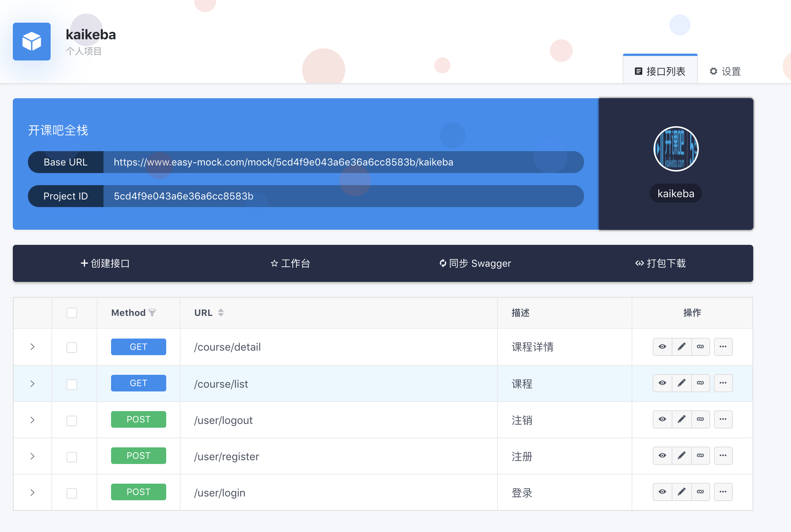

# Vue.js最佳实践

[TOC]


## 0. 作业

1. 测试题不用每个都答对，目的不是分数，是思考和讨论的过程 只要做了都返钱
2. 答的不好不要气馁，思考


1、关于MVVM的理解，下列哪项是不正确的？(D)[单选题]
A、Model代表数据模型，也可以在Model中定义数据修改和操作的业务逻辑。
B、View代表UI 组件，它负责将数据模型转化成UI 展现出来。
C、ViewModel 监听模型数据的改变和控制视图行为、处理用户交互。
D、在MVVM架构下，开发者完全不需要手动操作DOM，数据状态的同步由MVVM管理。

scroll focus 咱们第一次课做的弹窗，都需要手动操作


2、关于Vue的生命周期，下列哪项是不正确的？(B)[单选题]
A、Vue 实例从创建到销毁的过程，就是生命周期。
B、页面首次加载会触发beforeCreate, created, beforeMount, mounted, beforeUpdate, updated。
C、created表示完成数据观测，属性和方法的运算，初始化事件，$el属性还没有显示出来。
D、DOM 渲染在 mounted 中就已经完成了。

beforeUpdate, updated。这个是更新

3、关于Vue组件间的参数传递，下列哪项是不正确的？(C)[单选题]
A、子组件给父组件传值，使用$emit方法
B、子组件使用$emit('someEvent')派发事件，父组件使用@someEvent监听
C、祖孙组件间可以使用provide和inject方式跨层级相互传值 
D、父组件给子组件传值，子组件通过props接受数据

不能相互 再解释一下$emit


4、下列关于v-model的说法，哪项是正确的？(BD)[多选题]
A、v-model只能用于表单控件，实现双向数据绑定
B、v-model本质上是语法糖，它实现了用户的输入事件监听以及数据更新
C、v-model是内置指令，不能用在自定义组件上
D、对input使用v-model实际上是指定其:value和@input

我敲错了，也算是检验大家学习成果，嗯 是这样的


5、下列说法正确的是哪项？(ACD)[多选题]
A、key的作用主要是为了高效的更新虚拟DOM
B、若指定了组件的template选项，render函数不会执行
C、使用vm.$nextTick可以确保获得DOM异步更新的结果
D、若没有el选项，vm.$mount(dom)可将Vue实例挂载于指定元素上

render优先级高


思考题

dispatch boardcast

进阶思考题  

如何做到子元素全选后，父元素自动全选？


## 1. 课前准备

回顾

provide && inject

$emit 

组件化

项目基础


## 2. 课堂主题

1. vue-cli
2. webpack
3. vuex
4. vue-router
5. 工作流
6. 权限


## 3. 课堂目标


## 4. 知识点

### 数据mock的姿势


1. vue-cli假数据，利用webpack-dev-server中内置的express

```js
module.exports = {
  configureWebpack: {
    // 扩展webpack
    devServer: {
      before(app) {
        // app其实就是个exoress
        app.get('/api/goods', function (req, res) {
          res.json({
            list: [
              { text: '百万年薪架构师', price: 100 },
              { text: 'web全栈架构师', price: 80 },
              { text: 'Python爬虫', price: 60 }
            ]
          });
        });
      }
    }
  }
}
```


2. easy-mock + proxy

开发项目大部分 都会采用swagui 或者easy-mock这种接口文档工具


### vue-cli

```bash
➜  ~ vue
Usage: vue <command> [options]

Options:
  -V, --version                              output the version number
  -h, --help                                 output usage information

Commands:
  create [options] <app-name>                create a new project powered by vue-cli-service
  add [options] <plugin> [pluginOptions]     install a plugin and invoke its generator in an already created project
  invoke [options] <plugin> [pluginOptions]  invoke the generator of a plugin in an already created project
  inspect [options] [paths...]               inspect the webpack config in a project with vue-cli-service
  serve [options] [entry]                    serve a .js or .vue file in development mode with zero config
  build [options] [entry]                    build a .js or .vue file in production mode with zero config
  ui [options]                               start and open the vue-cli ui
  init [options] <template> <app-name>       generate a project from a remote template (legacy API, requires @vue/cli-init)
  config [options] [value]                   inspect and modify the config
  upgrade [semverLevel]                      upgrade vue cli service / plugins (default semverLevel: minor)
  info                                       print debugging information about your environment

  Run vue <command> --help for detailed usage of given command.
```

常用的还是vue create 具体vue cli工作的流程我们可以后面分析，重点要掌握内部核心还是webpack来实现



baseurl + 接口url

<https://www.easy-mock.com/mock/5cd4f9e043a6e36a6cc8583b/kaikeba/course/list>


```js
        proxy: {
            '/easymock': {
                target: ' https://www.easy-mock.com/mock/5cd4f9e043a6e36a6cc8583b/kaikeba',
                changeOrigin: true,
                ws: true,
                pathRewrite: {
                  '^/easymock': ''
                }
            }
          }
```


后端的开发环境，调试接口 ，除了proxy，还可以让后端直接开启跨域


```js
const express = require('express');
const app = express();

// //设置允许跨域访问该服务.
app.all('*', function (req, res, next) {
  res.header('Access-Control-Allow-Origin', '*');
  res.header('Access-Control-Allow-Headers', 'Content-Type');
  res.header('Access-Control-Allow-Methods', '*');
  res.header('Content-Type', 'application/json;charset=utf-8');
  next();
});

app.get('/api/goods', function (req, res) {
    res.json({
        title:'正式环境',
      list: [
        { text: '百万年薪架构师', price: 100 },
        { text: 'web全栈架构师', price: 8000 },
        { text: 'Python爬虫', price: 60 }
      ]
    });
});

const server = app.listen(9082, function () {
  console.log('Express app server listening on port %d', server.address().port);
});
```


### npm scripts + git hooks

npm run lint 校验规则，每次手动执行太麻烦，我们希望做的，git的代码里保持纯净就可以，所以我们使用git hook 在commit代码之前，进行校验，lint不通过就不让commit

我们使用husky支持更多的 Git Hooks 种类，再结合 [lint-staged](https://link.juejin.im/?target=https%3A%2F%2Fgithub.com%2Fokonet%2Flint-staged) 

```js
npm i husky lint-staged -D
```


装完就发现.git/hooks/precommit被husky改写了

```bash
➜  hooks git:(master) cat pre-commit
#!/bin/sh
# husky

# Hook created by Husky
#   Version: 2.3.0
#   At: 2019-5-30 17:54:05
#   See: https://github.com/typicode/husky#readme

# From
#   Directory: /Users/woniuppp/github/vue-master-lesson/02/node_modules/husky
#   Homepage: https://github.com/typicode/husky#readme
```


git push配合docker自动化部署 第四天再唠


### webpack


### 项目规范最佳实践

Lint hook npm script

### Vue-router


### vuex


### axios


### Typescript


## 5. 扩展


## 6. 总结


## 7. 作业


## 8. 问答


## 9. 预告